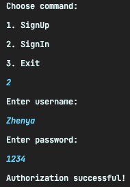
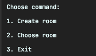
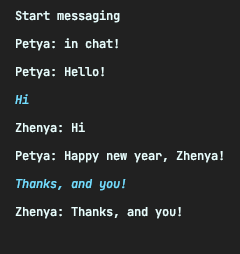
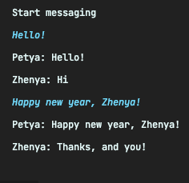
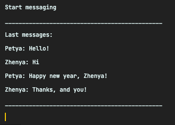

<p align="center">

</p>


# Multi-user Chat
### Implementation of a full-scale, multi-user chat with registration, chatrooms and message history<br>
The app allows you to start the server, connect multiple clients in different chatrooms and chating

## Architecture

The general architecture of the program is based on the **Client-Server** pattern, every client starts in **multithreads mode** and has a console interface.
_____
## Technologies
- The application is coded in ``Java 8``, run with ``Spring Boot``, configurated with ``Spring Annotations``;
- Users, Messages and Chatrooms are stored in DataBase ``PostgreSQL``;
- Work with DB implemented through ``Jpa Hibernate``;
- Project assembly implemented on ``Maven``;
- Clients starts in ``asynchronous multithreads mode``;
____
### Registration

<p align="center">

</p>

The app allows you to create new account or enter in existing account.<br>
Every password is encoded with ``PasswordEncoder from Spring Security``.<br>
____

### Chatrooms
<p align="center">

</p>

After registration every user can choose the existing *chatroom* and join to other clients in this chat or can create *his own chatroom*. <br>
________

### Chatting
<p align="center">


</p>

Every user can see only messages from current chat and send messages to this chat<br>
____

### Message history
<p align="center">

</p>

If user was in current chatroom and chatted with friends already, after sign in he get *the latest 30 messages* from this chat <br>
________
### Run programm
To run the server you need to specify a specific port and run the server program with arguments like this:
```
--port=8000
```
To run each client you need specify arguments like this:
```
--server-port=8000
```


